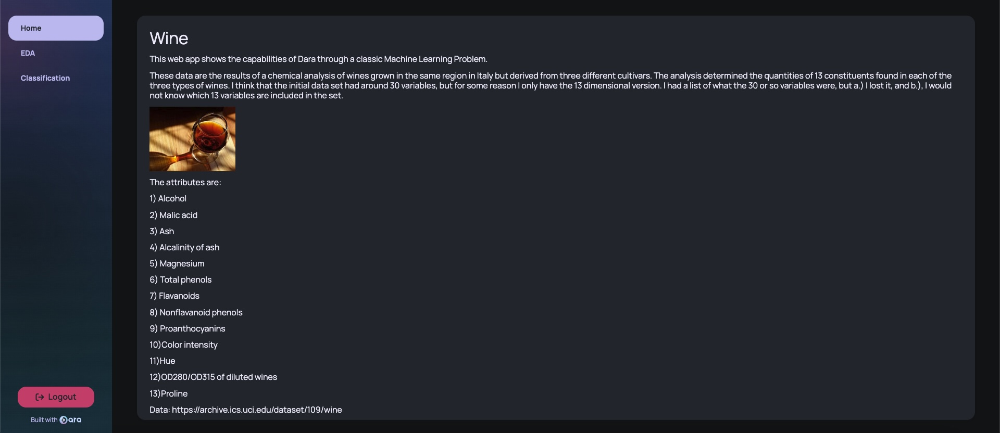
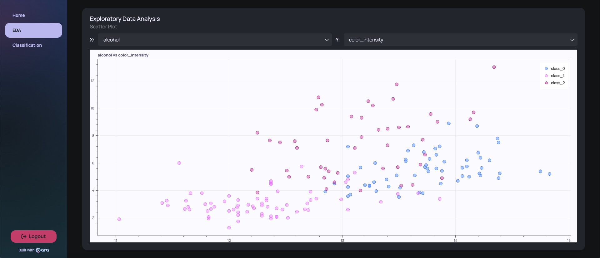
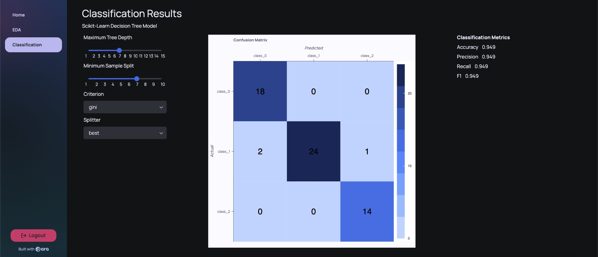

# My first Dara App: Wine Classification Problem

---

## A. Screenshots

Home page

EDA page

Classification page

## B. Installation and Setup

### 1. Poetry

* [Install](https://python-poetry.org/docs/#installing-with-the-official-installer) `curl -sSL https://install.python-poetry.org | python3 -`

* Add `export PATH="$HOME/.local/bin:$PATH"` to `.zshrc` ([source](https://stackoverflow.com/a/60768677/5609328))

* Use `poetry --version`

### 2. Create new app and install dara

* Create new app
  * In PyCharm with new poetry env
  * manually using `mkdir` and `poetry init`

* Run `poetry install`

* Install `poetry add dara-core --extras all`

## C. Creating a basic app tutorial

### 1. Hello World

* Add base code to `main.py`

* Run `poetry run dara start`

* Visit http://0.0.0.0:8000/

### 2. Add new pages

* Install dependencies to build a page that cna handle data: `poetry add scikit-learn`

* Create a `pages` subdir and add new pages in python there

* Add new pages to the main config using `config.add()`

## 3.Future Components

* [ ] Choose model from list of model e.g., RF, GBMs, SVM, ...
* [ ] More model validation metrics (ROC curve, precision/recall trade-off)
* [ ] More EDA (similar to pandas-profiling)

## Contact

* Email address: adam[dot]jaamour[at]causalens[dot]com
